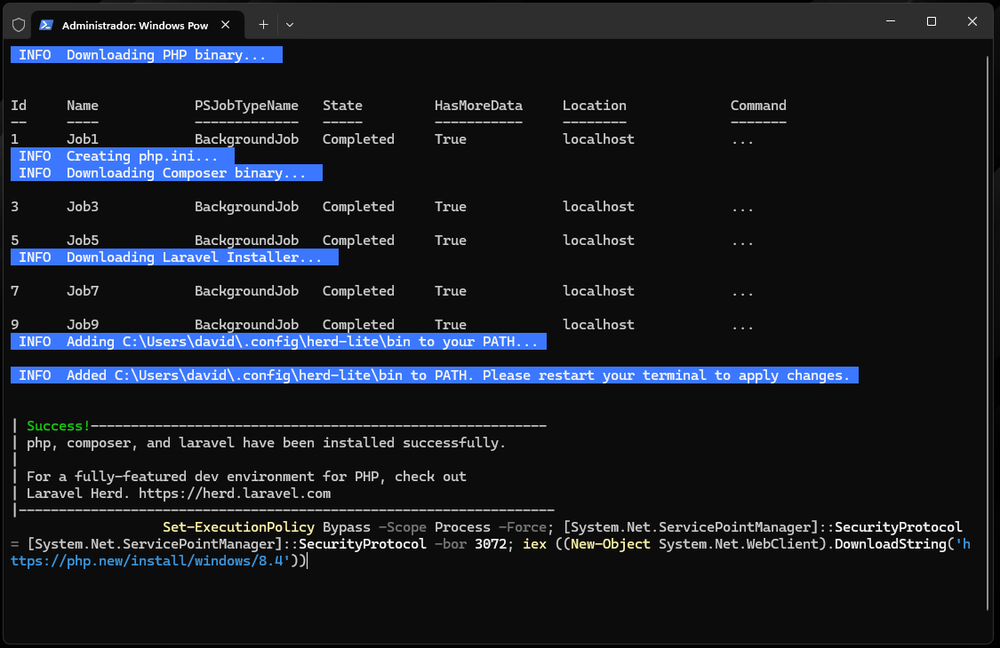
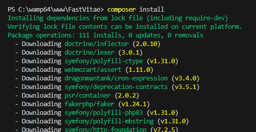

# Manual Tecnico - Fastvitae
David Escutia de Haro

## Indice
- [Herramientas usadas en el desarrollo](#herramientas-usadas)
    - [HTML](#html)
    - [CSS](#css)
    - [JavaScript](#javascript)
    - [PHP](#php)
    - [Laravel](#laravel)
    - [Composer](#composer)
    - [Apache](#apache)
    - [Docker](#docker)
- [Instalacion del web server](#instalacion-del-web-server)
- [Configuracion inicial de la aplicación](#configuracion-inicial-de-la-aplicación)
- [Casos de uso](#casos-de-uso)

## Herramientas usadas
### HTML


### CSS


### JavaScript


### PHP


### Laravel


### Composer


### Apache


### Docker


## Instalacion del web server


## Configuracion inicial de la aplicación
Instalar **PHP**, **composer** y el **instalador de laravel** con el siguiente comando, segun el sistema operativo:
```PowerShell
# Windows Powershell
Set-ExecutionPolicy Bypass -Scope Process -Force; [System.Net.ServicePointManager]::SecurityProtocol = [System.Net.ServicePointManager]::SecurityProtocol -bor 3072; iex ((New-Object System.Net.WebClient).DownloadString('https://php.new/install/windows/8.4'))
```

```shell
# Linux
/bin/bash -c "$(curl -fsSL https://php.new/install/linux/8.4)"
```



Instalar composer 



Ejecutar la migracion de tablas de la base de datos
>[!WARNING]
>Necesitas tener el archivo de variable de entorno **.env** configurado,